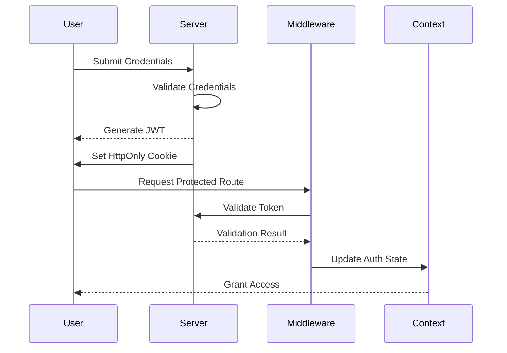

# 🔒 Next.js JWT & Cookie Authentication


<h2 align="center">
  🔧 <b>Tech Stack</b> ⚙️
</h2>

<p align="center">
  <a href="https://nextjs.org/" target="_blank">
    
  </a>
  <a href="https://www.typescriptlang.org/" target="_blank">
    
  </a>
  


  <a href="https://tailwindcss.com/" target="_blank">
    
  </a>


  <a href="https://jotai.org/" target="_blank">
    
  </a>

  <a href="https://jwt.io/" target="_blank">
    
  </a>
</p>

This project demonstrates a simple user authentication system using **Next.js 15** with **JWT (JSON Web Token)** for **authentication** and cookies for session management. It includes basic functionality for user registration, login, and protected routes. 

## Key Features ✨

- 🔐 JWT Authentication with HttpOnly Cookies
- 🛡️ Protected Routes using Middleware
- 📦 State Management with React Context
- 📱 Responsive UI with Tailwind CSS
- 📑 Form Validation & Server Actions
- 🔄 CRUD Operations with API Routes
- 🧩 Modular Component Architecture
- ✅ Full TypeScript Support

## Project Structure 📂
```
┏━━ 📁 nextjs-jwt-cookie-authentication/
┃
┣━ 📄 .env.example                # Environment variables template
┣━ 📁 public/                     # Static assets
┗━ 📁 src/                        # Source code
   │
   ├─ 📄 middleware.ts            🔐 Authentication middleware
   │
   ├─ 📁 actions/                 ⚡ Server actions
   │  ├─ 📄 formActions.ts        📋 Form handling logic
   │  ├─ 📄 isLogin.ts            🔒 Authentication check
   │  └─ 📄 postActions.ts        📮 Post-related operations
   │
   ├─ 📁 app/                     🏠 Application core
   │  │
   │  ├─ 📁 api/                  🌐 API endpoints
   │  │  └─ 📁 auth/              🔑 Authentication routes
   │  │     ├─ 📁 login/          🔓 Login endpoint
   │  │     │  └─ 📄 route.ts
   │  │     └─ 📁 signup/         📝 Registration endpoint
   │  │        └─ 📄 route.ts
   │  │
   │  ├─ 📁 context/              🧠 Application state
   │  │  └─ 📄 CoockiesProvider.tsx 🍪 Cookie management
   │  │
   │  ├─ 📁 posts/                📚 Post management
   │  │  └─ 📁 [id]/              #️⃣ Dynamic post routes
   │  │     └─ 📄 page.tsx
   │  │
   │  └─ 📁 users/                👥 User management
   │
   └─ 📁 components/              🧩 Reusable UI components
      ├─ 📁 Buttons/              🕹️ Interactive elements
      │  └─ 📄 LikeButton.tsx     ❤️ Like button component
      │
      ├─ 📁 Header/               🔖 Navigation header
      │  └─ 📄 Header.tsx
      │
      └─ 📁 Footer/               🦶 Page footer
         └─ 📄 index.tsx
```

## 🛠️ Installation & Setup

### 1️⃣ Clone the repository

```bash
git clone https://github.com/AbbasRostami/NextJS-JWT-Cookie-Authentication.git
cd NextJS-JWT-Cookie-Authentication
```

### 2️⃣ Install dependencies

```
yarn install  # or npm install
```

### 3️⃣ Set your JWT_SECRET in the .env file:
Create a **.env.local** file and copy the values from **.env.example**, then update them with your credentials.
```bash
# Create environment file
JWT_SECRET=your_secret_key
```

### 4️⃣ Run the project
```
yarn dev  # or npm run dev
```

Application will be running at: http://localhost:3000


## 🏗️ Core Architecture

### 🔄 Authentication Flow


## 🧩 Key Components

### 🍪 `CoockiesProvider.tsx`
**Core Responsibilities**:
- 🔄 State Management for authentication cookies
- 🛡️ Context Provider for global auth access
- 🔒 Secure cookie operations (get/set/remove)

### 🚧 `middleware.ts`
**Security Features**:
- 🔐 Route protection & access control
- ✅ JWT validation & token verification
- 👮 Role-based authorization system

---

## 📡 API Endpoints

| Endpoint            |  Method  |            Description          |
|---------------------|----------|---------------------------------|
| `/api/auth/login`   |  `POST`  | User login with JWT issuance    |
| `/api/auth/signup`  |  `POST`  | New user registration           |


## 🔐 Protected Routes

Some routes (**/posts**, **/users**) are **protected** and require authentication. Middleware in **middleware.ts** handles access control.

## 📜 License

This project is open-source and available under the **MIT License**.

---

**Happy Coding!** 🚀  
**Developed with ❤️ by [Abbas Rostami](https://github.com/AbbasRostami)**  

[](https://github.com/AbbasRostami/NextJS-JWT-Cookie-Authentication/stargazers)
